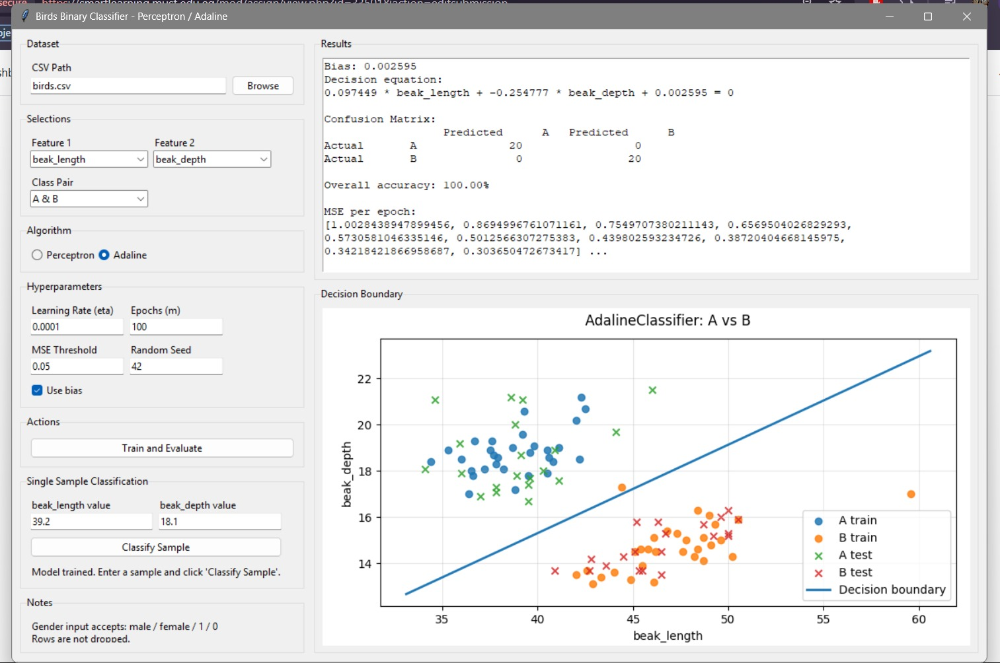
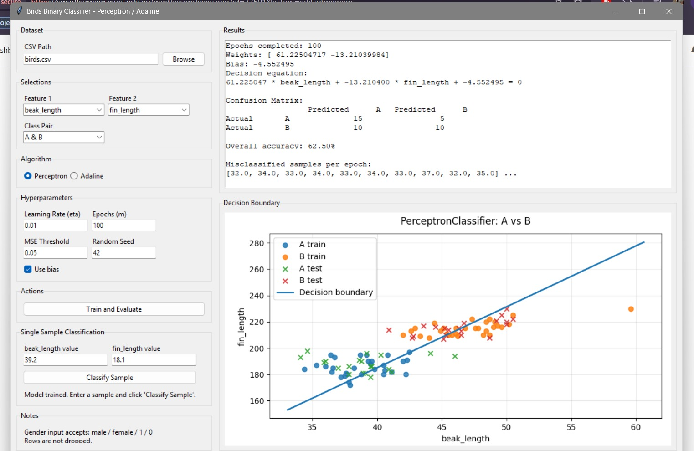

# Birds Binary Classifier Project

A complete Python project for **Task 1** that implements both:

- **Perceptron**
- **Adaline (using MSE stopping)**

It also includes a **Tkinter GUI** for training, testing, visualization, and single-sample classification.

## What this project does

- Loads `birds.csv`
- Uses **exactly 2 selected features**
- Uses **exactly 2 selected classes** from:
  - A & B
  - A & C
  - B & C
- Splits the selected classes into:
  - **30 training samples per class**
  - **20 testing samples per class**
- Initializes **weights and bias with small random numbers**
- Trains either:
  - **Perceptron**
  - **Adaline**
- Draws the **decision boundary**
- Builds the **confusion matrix manually**
- Computes **overall accuracy**
- Classifies a **single new sample** from the GUI

---

## Notes about preprocessing

This project follows the assignment constraints:

- **No rows are dropped**
- `gender` is **preprocessed** before use
- Missing `gender` values are filled using the **mode of the same bird class**
- Gender is encoded as:
  - `female -> 0`
  - `male -> 1`

---

## Project structure

```text
birds_classifier_project/
|-- main.py
|-- run_experiments.py
|-- requirements.txt
|-- README.md
|-- docs/
|   `-- screenshots/
|       |-- birds-adaline-gui.jpeg
|       `-- birds-perceptron-gui.jpeg
`-- src/
    |-- __init__.py
    |-- constants.py
    |-- data_loader.py
    |-- perceptron.py
    |-- adaline.py
    |-- metrics.py
    |-- pipeline.py
    |-- visualization.py
    `-- gui.py
```

---

## Installation

```bash
pip install -r requirements.txt
```

---

## Run the GUI

Put `birds.csv` in the project folder, or browse to it from the GUI.

```bash
python main.py
```

---

## Screenshots

These screenshots show the birds classifier GUI included in this repository.

### 1. Birds classifier GUI with Adaline



This screenshot shows the Tkinter birds classifier running the Adaline model on `beak_length` and `beak_depth`, including the results panel and the plotted decision boundary.

### 2. Birds classifier GUI with Perceptron



This screenshot shows the same GUI using the Perceptron model on `beak_length` and `fin_length`, with the learned boundary and evaluation output visible after training.

---

## Run automatic experiment summaries

This helper script evaluates **all feature pairs** against **all class pairs** for one algorithm and writes a CSV summary.

### Perceptron example

```bash
python run_experiments.py --csv birds.csv --algorithm perceptron --eta 0.01 --epochs 100 --bias
```

### Adaline example

```bash
python run_experiments.py --csv birds.csv --algorithm adaline --eta 0.000001 --epochs 200 --mse-threshold 0.05 --bias
```

It creates a file like:

```text
experiment_summary_perceptron.csv
```

This is useful for your report to find:
- good and bad feature combinations
- the highest accuracy combination

---

## GUI inputs

The GUI lets you choose:

- Feature 1
- Feature 2
- Class pair
- Learning rate (`eta`)
- Number of epochs (`m`)
- MSE threshold (`mse_threshold`) for Adaline
- Bias on/off
- Random seed
- Algorithm: Perceptron or Adaline

It also has a section to classify a single sample after training.

### If `gender` is one of the selected features

You may enter any of:

- `male`
- `female`
- `1`
- `0`

---

## Recommended starting hyperparameters

Because the features have different numeric scales, try:

### Perceptron
- `eta = 0.001` or `0.01`
- `epochs = 100`

### Adaline
- `eta = 0.000001` to `0.0001`
- `epochs = 200`
- `mse_threshold = 0.05`

If Adaline diverges, reduce the learning rate.

---

## Confusion matrix format

Rows are **actual classes** and columns are **predicted classes**:

```text
               Predicted C1   Predicted C2
Actual C1           ...
Actual C2           ...
```

For internal binary labels:
- first selected class -> `-1`
- second selected class -> `1`

---

## Assignment checklist covered

- [x] Perceptron implemented
- [x] Adaline implemented using MSE
- [x] GUI implemented
- [x] Decision boundary plotting
- [x] Manual confusion matrix
- [x] Overall accuracy
- [x] 30/20 train-test split per class
- [x] Separate logic from UI
- [x] Gender preprocessing
- [x] No rows dropped

---

## Dataset path

Default GUI path is:

```text
birds.csv
```

If your CSV is somewhere else, click **Browse** in the GUI.
